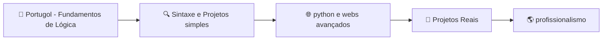

<h1 align="center">👋 Olá, eu sou o Brunno!</h1>
<h3 align="center">🌐 Desenvolvedor Back-end em Formação | Brasil 🌐 </h3>

  

---

## 📚 Minha Jornada

---

<h2 align="center"> 📦O QUE VOCÊ VAI ENCONTRAR AQUI </h2>

<ul align="left"> 
   <li> 🧠 Exercícios e prática de lógicas  </li>   
   <li> 🐍 Estudos de python </li>
   <li> 🌐 HTML e CSS </li>
   <li> 📝 Testes, anotações e pequenos projetos </li>
   <li> 📈 Evolução constante como dev </li>
</ul>

---

<h2 align="center"> 👤SOBRE MIM </h2>

<ul align="left">
  <li> 🔧 Pretendo me tornar desenvolvedor back-end</li>
  <li> 🐍 Atualmente estudando Python</li>
  <li> 🚀 Sonhando (e trabalhando) para estudar e trabalhar nos EUA</li>
  <li> 📈 Comprometido em evoluir um pouco todos os dias</li>
</ul>

---

<h3 align="center">  Esse repositório é meu campo de treino — onde cada linha de código conta. </h3>
